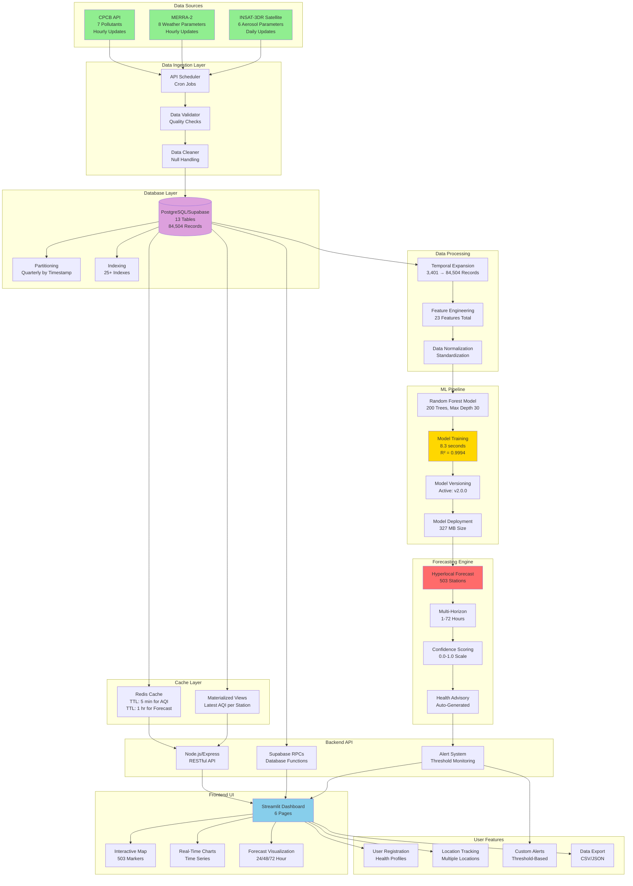
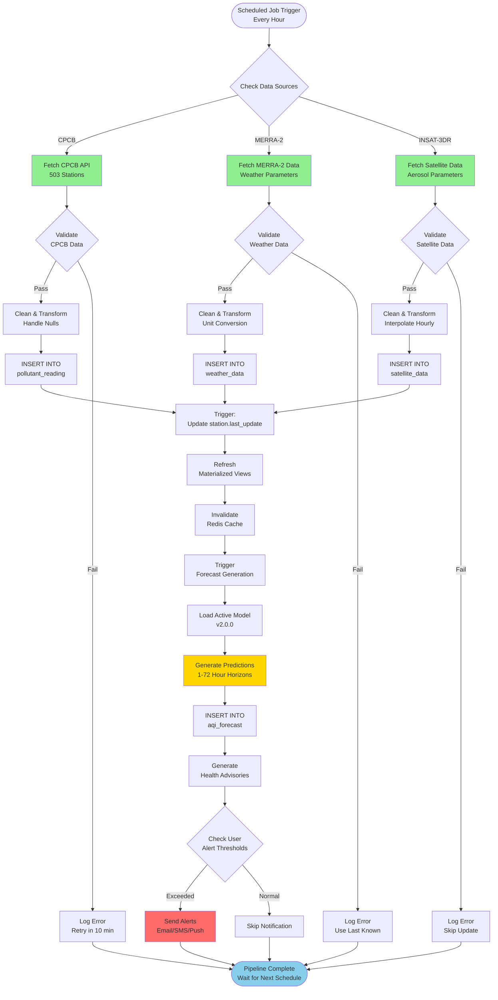
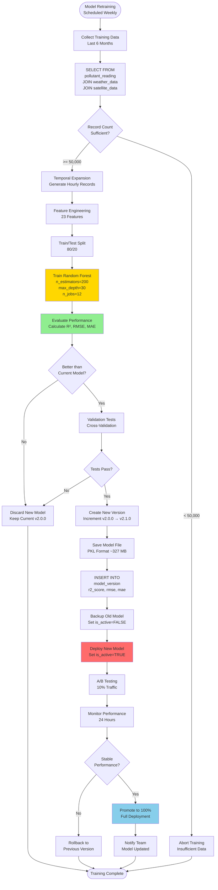
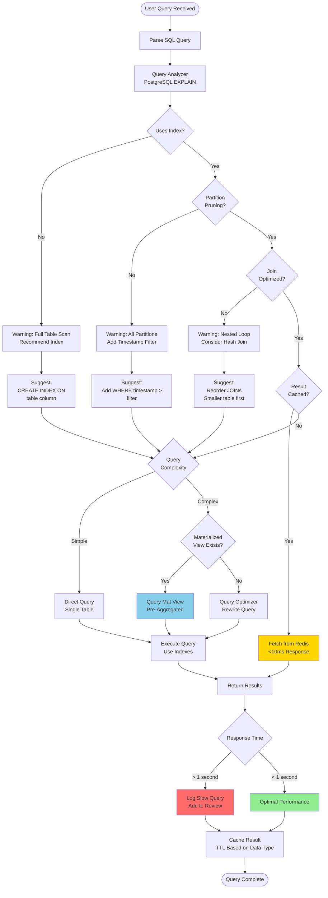

# Vayu Drishti - Data Dictionary & Flowcharts

## Complete Data Dictionary for Air Quality Monitoring System

---

## Table of Contents
1. [Core Entity Tables](#core-entity-tables)
2. [Data Collection Tables](#data-collection-tables)
3. [Forecasting Tables](#forecasting-tables)
4. [User Management Tables](#user-management-tables)
5. [Support Tables](#support-tables)
6. [System Flowcharts](#system-flowcharts)

---

## Core Entity Tables

### 1. AQI_STATION

| Column Name | Data Type | Constraints | Description | Example Value |
|-------------|-----------|-------------|-------------|---------------|
| station_id | INT | PRIMARY KEY, AUTO_INCREMENT | Unique identifier for monitoring station | 1001 |
| station_name | VARCHAR(200) | NOT NULL | Official name of the monitoring station | "Delhi - ITO" |
| latitude | DECIMAL(10,7) | NOT NULL, CHECK (-90 to 90) | Geographic latitude coordinate | 28.6273928 |
| longitude | DECIMAL(10,7) | NOT NULL, CHECK (-180 to 180) | Geographic longitude coordinate | 77.2403256 |
| state | VARCHAR(50) | | State/Province name | "Delhi" |
| city | VARCHAR(100) | | City name | "New Delhi" |
| district | VARCHAR(50) | | District name | "Central Delhi" |
| station_type | VARCHAR(50) | CHECK (CPCB/Manual/Satellite/Hybrid) | Type of monitoring station | "CPCB" |
| last_update | TIMESTAMP | | Last data received timestamp | 2025-10-30 14:30:00 |
| is_active | BOOLEAN | DEFAULT TRUE | Whether station is operational | TRUE |
| data_source | VARCHAR(50) | | Primary data source | "CPCB_API" |
| location_id | INT | FOREIGN KEY → location(location_id) | Reference to location details | 501 |
| created_at | TIMESTAMP | DEFAULT CURRENT_TIMESTAMP | Record creation timestamp | 2024-01-15 08:00:00 |
| updated_at | TIMESTAMP | DEFAULT CURRENT_TIMESTAMP | Last record update timestamp | 2025-10-30 14:30:00 |

**Record Count:** 503 stations  
**Update Frequency:** Real-time (every hour)  
**Primary Index:** station_id  
**Secondary Indexes:** location_id, is_active

---

### 2. LOCATION

| Column Name | Data Type | Constraints | Description | Example Value |
|-------------|-----------|-------------|-------------|---------------|
| location_id | INT | PRIMARY KEY, AUTO_INCREMENT | Unique identifier for location | 501 |
| latitude | DECIMAL(10,7) | NOT NULL, CHECK (-90 to 90) | Geographic latitude | 28.6273928 |
| longitude | DECIMAL(10,7) | NOT NULL, CHECK (-180 to 180) | Geographic longitude | 77.2403256 |
| city | VARCHAR(100) | | City name | "New Delhi" |
| state | VARCHAR(50) | | State name | "Delhi" |
| district | VARCHAR(50) | | District name | "Central Delhi" |
| pincode | VARCHAR(6) | | Postal code | "110002" |
| population | INT | | Population in the area | 25000000 |
| location_type | VARCHAR(20) | CHECK (Urban/Rural/Peri-urban) | Classification of location | "Urban" |
| geom | GEOMETRY(Point, 4326) | SPATIAL INDEX | PostGIS spatial column for GIS queries | POINT(77.2403 28.6273) |
| created_at | TIMESTAMP | DEFAULT CURRENT_TIMESTAMP | Record creation timestamp | 2024-01-15 08:00:00 |
| updated_at | TIMESTAMP | DEFAULT CURRENT_TIMESTAMP | Last record update timestamp | 2025-10-30 14:30:00 |

**Record Count:** 503 locations  
**Spatial Features:** PostGIS enabled for distance calculations  
**Primary Index:** location_id  
**Spatial Index:** GIST on geom column

---

### 3. DATA_SOURCE

| Column Name | Data Type | Constraints | Description | Example Value |
|-------------|-----------|-------------|-------------|---------------|
| data_source_id | INT | PRIMARY KEY, AUTO_INCREMENT | Unique identifier for data source | 1 |
| source_name | VARCHAR(100) | NOT NULL | Name of the data source | "CPCB Real-Time API" |
| source_type | VARCHAR(50) | CHECK (CPCB/MERRA2/INSAT3DR/Manual) | Type of data source | "CPCB" |
| api_endpoint | VARCHAR(500) | | API URL or data location | "https://api.cpcb.gov.in/..." |
| last_fetch | TIMESTAMP | | Last successful data fetch | 2025-10-30 14:00:00 |
| is_active | BOOLEAN | DEFAULT TRUE | Whether source is currently active | TRUE |
| fetch_frequency_minutes | INT | DEFAULT 60 | How often to fetch data (minutes) | 60 |
| created_at | TIMESTAMP | DEFAULT CURRENT_TIMESTAMP | Record creation timestamp | 2024-01-15 08:00:00 |

**Record Count:** 3 data sources (CPCB, MERRA-2, INSAT-3DR)  
**Update Frequency:** Hourly for CPCB, Daily for satellite  
**Primary Index:** data_source_id

---

## Data Collection Tables

### 4. POLLUTANT_READING

| Column Name | Data Type | Constraints | Description | Example Value |
|-------------|-----------|-------------|-------------|---------------|
| reading_id | BIGINT | PRIMARY KEY, AUTO_INCREMENT | Unique identifier for reading | 1234567 |
| station_id | INT | FOREIGN KEY → aqi_station(station_id), NOT NULL | Reference to monitoring station | 1001 |
| timestamp | TIMESTAMP | NOT NULL, INDEXED | Time of measurement | 2025-10-30 14:00:00 |
| pm25 | FLOAT | CHECK (>= 0) | PM2.5 concentration (μg/m³) | 85.3 |
| pm10 | FLOAT | CHECK (>= 0) | PM10 concentration (μg/m³) | 142.7 |
| no2 | FLOAT | CHECK (>= 0) | Nitrogen dioxide (μg/m³) | 45.2 |
| so2 | FLOAT | CHECK (>= 0) | Sulfur dioxide (μg/m³) | 12.8 |
| co | FLOAT | CHECK (>= 0) | Carbon monoxide (mg/m³) | 1.2 |
| o3 | FLOAT | CHECK (>= 0) | Ozone (μg/m³) | 38.5 |
| nh3 | FLOAT | CHECK (>= 0) | Ammonia (μg/m³) | 22.1 |
| aqi | INT | CHECK (0 to 500), NOT NULL | Air Quality Index | 156 |
| aqi_category | VARCHAR(20) | CHECK (Good/Moderate/Unhealthy for Sensitive/Unhealthy/Very Unhealthy/Hazardous) | AQI category | "Unhealthy" |
| confidence_score | FLOAT | CHECK (0 to 1) | Data quality confidence | 0.95 |
| data_source_id | INT | FOREIGN KEY → data_source(data_source_id) | Source of data | 1 |
| created_at | TIMESTAMP | DEFAULT CURRENT_TIMESTAMP | Record creation timestamp | 2025-10-30 14:05:00 |

**Record Count:** 84,504 records (503 stations × 168 hours)  
**Partitioning:** By timestamp (quarterly partitions)  
**Update Frequency:** Hourly  
**Primary Index:** reading_id, timestamp  
**Composite Index:** (station_id, timestamp DESC)

---

### 5. WEATHER_DATA

| Column Name | Data Type | Constraints | Description | Example Value |
|-------------|-----------|-------------|-------------|---------------|
| weather_id | BIGINT | PRIMARY KEY, AUTO_INCREMENT | Unique identifier for weather record | 5678901 |
| station_id | INT | FOREIGN KEY → aqi_station(station_id), NOT NULL | Reference to monitoring station | 1001 |
| timestamp | TIMESTAMP | NOT NULL, INDEXED | Time of measurement | 2025-10-30 14:00:00 |
| temperature | FLOAT | | Air temperature (°C) | 28.5 |
| humidity | FLOAT | CHECK (0 to 100) | Relative humidity (%) | 65.2 |
| wind_speed | FLOAT | CHECK (>= 0) | Wind speed (m/s) | 3.5 |
| wind_direction | FLOAT | CHECK (0 to 360) | Wind direction (degrees) | 225.0 |
| surface_pressure | FLOAT | | Surface pressure (hPa) | 1013.25 |
| precipitation | FLOAT | CHECK (>= 0) | Precipitation (mm) | 0.0 |
| boundary_layer_height | FLOAT | CHECK (>= 0) | Planetary boundary layer height (m) | 1200.0 |
| atmospheric_pressure | FLOAT | | Atmospheric pressure (hPa) | 1015.3 |
| data_source_id | INT | FOREIGN KEY → data_source(data_source_id) | Source of data (MERRA-2) | 2 |
| created_at | TIMESTAMP | DEFAULT CURRENT_TIMESTAMP | Record creation timestamp | 2025-10-30 14:05:00 |

**Record Count:** 84,504 records (hourly for each station)  
**Data Source:** MERRA-2 Meteorological Data  
**Update Frequency:** Hourly  
**Primary Index:** weather_id  
**Composite Index:** (station_id, timestamp DESC)

---

### 6. SATELLITE_DATA

| Column Name | Data Type | Constraints | Description | Example Value |
|-------------|-----------|-------------|-------------|---------------|
| satellite_id | BIGINT | PRIMARY KEY, AUTO_INCREMENT | Unique identifier for satellite record | 9876543 |
| station_id | INT | FOREIGN KEY → aqi_station(station_id), NOT NULL | Reference to monitoring station | 1001 |
| timestamp | TIMESTAMP | NOT NULL, INDEXED | Time of observation | 2025-10-30 10:30:00 |
| aod550 | FLOAT | CHECK (>= 0) | Aerosol Optical Depth at 550nm | 0.45 |
| aerosol_index | FLOAT | | Aerosol Index | 1.2 |
| cloud_fraction | FLOAT | CHECK (0 to 1) | Cloud coverage fraction | 0.15 |
| surface_reflectance | FLOAT | CHECK (0 to 1) | Surface reflectance | 0.25 |
| angstrom_exponent | FLOAT | | Ångström exponent | 1.3 |
| single_scattering_albedo | FLOAT | CHECK (0 to 1) | Single scattering albedo | 0.92 |
| satellite_name | VARCHAR(50) | DEFAULT 'INSAT-3DR' | Satellite source | "INSAT-3DR" |
| spatial_resolution | FLOAT | | Spatial resolution (km) | 10.0 |
| data_source_id | INT | FOREIGN KEY → data_source(data_source_id) | Source of data (INSAT-3DR) | 3 |
| created_at | TIMESTAMP | DEFAULT CURRENT_TIMESTAMP | Record creation timestamp | 2025-10-30 10:35:00 |

**Record Count:** 84,504 records (hourly interpolated)  
**Data Source:** INSAT-3DR Satellite  
**Update Frequency:** Daily (interpolated to hourly)  
**Primary Index:** satellite_id  
**Composite Index:** (station_id, timestamp DESC)

---

## Forecasting Tables

### 7. MODEL_VERSION

| Column Name | Data Type | Constraints | Description | Example Value |
|-------------|-----------|-------------|-------------|---------------|
| model_version_id | INT | PRIMARY KEY, AUTO_INCREMENT | Unique identifier for model version | 5 |
| model_name | VARCHAR(50) | NOT NULL | Name of ML model | "RandomForestRegressor" |
| version_number | VARCHAR(20) | NOT NULL | Version string | "v2.0.0" |
| r2_score | FLOAT | | R² performance metric | 0.9994 |
| rmse | FLOAT | | Root Mean Square Error | 4.57 |
| mae | FLOAT | | Mean Absolute Error | 2.33 |
| n_estimators | INT | | Number of trees (Random Forest) | 200 |
| max_depth | INT | | Maximum tree depth | 30 |
| trained_at | TIMESTAMP | DEFAULT CURRENT_TIMESTAMP | When model was trained | 2025-10-15 10:00:00 |
| training_records | INT | | Number of training records | 84504 |
| feature_list | TEXT | | Comma-separated list of features | "pm25,pm10,no2,latitude,..." |
| is_active | BOOLEAN | DEFAULT FALSE | Whether model is in production | TRUE |
| deployed_at | TIMESTAMP | | When model was deployed | 2025-10-16 08:00:00 |

**Record Count:** 5 model versions  
**Current Active Model:** v2.0.0 (R²=0.9994, RMSE=4.57)  
**Training Time:** 8.3 seconds  
**Model Size:** 327 MB  
**Primary Index:** model_version_id  
**Unique Index:** (model_name, version_number)

---

### 8. AQI_FORECAST

| Column Name | Data Type | Constraints | Description | Example Value |
|-------------|-----------|-------------|-------------|---------------|
| forecast_id | BIGINT | PRIMARY KEY, AUTO_INCREMENT | Unique identifier for forecast | 7654321 |
| station_id | INT | FOREIGN KEY → aqi_station(station_id), NOT NULL | Reference to monitoring station | 1001 |
| forecast_time | TIMESTAMP | NOT NULL | When forecast was generated | 2025-10-30 14:00:00 |
| prediction_time | TIMESTAMP | NOT NULL, INDEXED | Time being predicted | 2025-10-31 14:00:00 |
| predicted_aqi | INT | CHECK (0 to 500), NOT NULL | Predicted AQI value | 168 |
| aqi_category | VARCHAR(20) | | Predicted AQI category | "Unhealthy" |
| confidence_score | FLOAT | CHECK (0 to 1) | Model confidence | 0.94 |
| forecast_horizon_hours | INT | CHECK (1 to 72) | Hours ahead being predicted | 24 |
| pm25_forecast | FLOAT | | Predicted PM2.5 | 92.5 |
| pm10_forecast | FLOAT | | Predicted PM10 | 155.3 |
| no2_forecast | FLOAT | | Predicted NO2 | 48.7 |
| upper_bound | FLOAT | | Upper confidence bound (AQI + RMSE) | 172.57 |
| lower_bound | FLOAT | | Lower confidence bound (AQI - RMSE) | 163.43 |
| model_version_id | INT | FOREIGN KEY → model_version(model_version_id) | Model used for prediction | 5 |
| created_at | TIMESTAMP | DEFAULT CURRENT_TIMESTAMP | Record creation timestamp | 2025-10-30 14:02:00 |

**Record Count:** ~36,000 forecasts per day (503 stations × 72 hours)  
**Partitioning:** By prediction_time (monthly partitions)  
**Update Frequency:** Every hour  
**Forecast Horizons:** 1-72 hours  
**Primary Index:** forecast_id, prediction_time  
**Composite Index:** (station_id, prediction_time)

---

### 9. HEALTH_ADVISORY

| Column Name | Data Type | Constraints | Description | Example Value |
|-------------|-----------|-------------|-------------|---------------|
| advisory_id | INT | PRIMARY KEY, AUTO_INCREMENT | Unique identifier for advisory | 12345 |
| forecast_id | BIGINT | FOREIGN KEY → aqi_forecast(forecast_id), NOT NULL | Reference to forecast | 7654321 |
| aqi_category | VARCHAR(20) | NOT NULL | AQI category for advisory | "Unhealthy" |
| general_advice | TEXT | | Advice for general population | "Reduce prolonged outdoor exertion" |
| sensitive_group_advice | TEXT | | Advice for sensitive groups | "Avoid prolonged outdoor activities" |
| outdoor_activity_advice | TEXT | | Specific outdoor activity guidance | "Limit to 30 minutes" |
| commute_advice | TEXT | | Commuting recommendations | "Use N95 masks if commuting" |
| mask_recommendation | TEXT | | Mask usage recommendation | "N95 or equivalent recommended" |
| created_at | TIMESTAMP | DEFAULT CURRENT_TIMESTAMP | Record creation timestamp | 2025-10-30 14:02:00 |
| updated_at | TIMESTAMP | DEFAULT CURRENT_TIMESTAMP | Last record update timestamp | 2025-10-30 14:02:00 |

**Record Count:** ~36,000 advisories per day (one per forecast)  
**Update Frequency:** Generated with each forecast  
**Primary Index:** advisory_id  
**Foreign Index:** forecast_id

---

## User Management Tables

### 10. USER (app_user)

| Column Name | Data Type | Constraints | Description | Example Value |
|-------------|-----------|-------------|-------------|---------------|
| user_id | INT | PRIMARY KEY, AUTO_INCREMENT | Unique identifier for user | 10001 |
| username | VARCHAR(50) | UNIQUE, NOT NULL | User's unique username | "air_quality_enthusiast" |
| email | VARCHAR(100) | UNIQUE, NOT NULL | User's email address | "user@example.com" |
| phone | VARCHAR(15) | | User's phone number | "+919876543210" |
| password_hash | VARCHAR(255) | NOT NULL | Bcrypt hashed password | "$2b$12$..." |
| registration_date | TIMESTAMP | DEFAULT CURRENT_TIMESTAMP | When user registered | 2025-01-15 10:30:00 |
| health_profile | VARCHAR(20) | CHECK (Normal/Sensitive/High-Risk) | User's health sensitivity | "Sensitive" |
| notifications_enabled | BOOLEAN | DEFAULT TRUE | Whether user receives alerts | TRUE |
| preferred_language | VARCHAR(10) | DEFAULT 'en' | Preferred language code | "en" |
| last_login | TIMESTAMP | | Last login timestamp | 2025-10-30 09:15:00 |
| is_active | BOOLEAN | DEFAULT TRUE | Account active status | TRUE |
| created_at | TIMESTAMP | DEFAULT CURRENT_TIMESTAMP | Record creation timestamp | 2025-01-15 10:30:00 |
| updated_at | TIMESTAMP | DEFAULT CURRENT_TIMESTAMP | Last record update timestamp | 2025-10-30 09:15:00 |

**Record Count:** Variable (user-dependent)  
**Security:** Row-level security enabled  
**Password:** Bcrypt hashed with salt  
**Primary Index:** user_id  
**Unique Indexes:** username, email

---

### 11. USER_LOCATION

| Column Name | Data Type | Constraints | Description | Example Value |
|-------------|-----------|-------------|-------------|---------------|
| user_location_id | INT | PRIMARY KEY, AUTO_INCREMENT | Unique identifier for user-location mapping | 50001 |
| user_id | INT | FOREIGN KEY → app_user(user_id), NOT NULL | Reference to user | 10001 |
| location_id | INT | FOREIGN KEY → location(location_id), NOT NULL | Reference to location | 501 |
| is_primary | BOOLEAN | DEFAULT FALSE | Whether this is user's primary location | TRUE |
| alert_threshold | INT | DEFAULT 150, CHECK (0 to 500) | AQI threshold for alerts | 150 |
| added_date | TIMESTAMP | DEFAULT CURRENT_TIMESTAMP | When location was added | 2025-01-15 10:35:00 |
| updated_at | TIMESTAMP | DEFAULT CURRENT_TIMESTAMP | Last record update timestamp | 2025-10-30 09:15:00 |

**Unique Constraint:** (user_id, location_id) - User can't add same location twice  
**Row-Level Security:** Users can only see their own locations  
**Primary Index:** user_location_id  
**Composite Index:** (user_id, is_primary)

---

### 12. USER_ALERT

| Column Name | Data Type | Constraints | Description | Example Value |
|-------------|-----------|-------------|-------------|---------------|
| alert_id | BIGINT | PRIMARY KEY, AUTO_INCREMENT | Unique identifier for alert | 99999 |
| user_id | INT | FOREIGN KEY → app_user(user_id), NOT NULL | Reference to user | 10001 |
| alert_time | TIMESTAMP | DEFAULT CURRENT_TIMESTAMP | When alert was generated | 2025-10-30 14:05:00 |
| alert_type | VARCHAR(50) | CHECK (Threshold/Forecast/Health/System) | Type of alert | "Threshold" |
| message | TEXT | NOT NULL | Alert message content | "AQI exceeded threshold: 168" |
| aqi_value | INT | CHECK (0 to 500) | AQI value that triggered alert | 168 |
| severity | VARCHAR(20) | CHECK (Info/Warning/Critical) | Alert severity level | "Warning" |
| is_read | BOOLEAN | DEFAULT FALSE | Whether user has read alert | FALSE |
| read_at | TIMESTAMP | | When user read the alert | NULL |
| created_at | TIMESTAMP | DEFAULT CURRENT_TIMESTAMP | Record creation timestamp | 2025-10-30 14:05:00 |

**Record Count:** Variable (alert-dependent)  
**Row-Level Security:** Users can only see their own alerts  
**Primary Index:** alert_id  
**Composite Index:** (user_id, alert_time DESC)  
**Filtered Index:** (user_id, is_read) WHERE is_read = FALSE

---

## System Flowcharts

### 1. Complete System Architecture Flow



---

### 2. Data Ingestion & ETL Pipeline



---

### 3. ML Model Training & Deployment Flow



---

### 4. User Interaction & Query Flow

```mermaid
flowchart LR
    USER([User Access<br/>Streamlit UI]) --> AUTH{User<br/>Authenticated?}
    
    AUTH -->|No| LOGIN[Login/Register<br/>Page]
    LOGIN --> VALIDATE[Validate Credentials<br/>Check password_hash]
    VALIDATE --> SESSION[Create Session<br/>JWT Token]
    SESSION --> DASH
    
    AUTH -->|Yes| DASH[Main Dashboard<br/>6 Pages]
    
    DASH --> PAGE{Select Feature}
    
    PAGE -->|Real-Time AQI| RT1[Real-Time AQI Page]
    PAGE -->|Forecast| FC1[Forecast Page]
    PAGE -->|Map| MAP1[Interactive Map Page]
    PAGE -->|Analytics| AN1[Analytics Page]
    PAGE -->|Alerts| AL1[My Alerts Page]
    PAGE -->|Settings| SET1[Settings Page]
    
    RT1 --> CACHE1{Check Redis<br/>Cache}
    CACHE1 -->|Hit| RETURN1[Return Cached<br/>AQI Data]
    CACHE1 -->|Miss| QUERY1[Query Database<br/>SELECT FROM<br/>latest_aqi_by_station]
    QUERY1 --> STORE1[Store in Cache<br/>TTL: 5 min]
    STORE1 --> RETURN1
    
    FC1 --> INPUT1[User Inputs<br/>Station + Horizon]
    INPUT1 --> CACHE2{Check Cache}
    CACHE2 -->|Hit| RETURN2[Return Forecast]
    CACHE2 -->|Miss| QUERY2[Query Database<br/>SELECT FROM<br/>aqi_forecast]
    QUERY2 --> ADVISORY1[Fetch Health Advisory]
    ADVISORY1 --> STORE2[Cache Result<br/>TTL: 1 hour]
    STORE2 --> RETURN2
    
    MAP1 --> BOUNDS[Get Map Bounds<br/>Lat/Lng Range]
    BOUNDS --> SPATIAL[Spatial Query<br/>ST_Within Geography]
    SPATIAL --> MARKERS[Generate Markers<br/>Color by AQI]
    MARKERS --> RENDER[Render Map<br/>Folium/Plotly]
    
    AN1 --> SELECT[Select Analytics<br/>Type]
    SELECT --> AGGR[Aggregate Queries<br/>GROUP BY, AVG]
    AGGR --> CHART[Generate Charts<br/>Plotly/Matplotlib]
    
    AL1 --> FILTER[Apply RLS Policy<br/>user_id = current_user]
    FILTER --> QUERY3[SELECT FROM<br/>user_alert<br/>WHERE user_id = ?]
    QUERY3 --> DISPLAY[Display Alerts<br/>Unread First]
    
    SET1 --> FORM[Settings Form<br/>Locations, Thresholds]
    FORM --> UPDATE[UPDATE user_location<br/>SET alert_threshold]
    UPDATE --> CONFIRM[Confirm Changes]
    
    RETURN1 --> DISPLAY_UI[Display to User]
    RETURN2 --> DISPLAY_UI
    RENDER --> DISPLAY_UI
    CHART --> DISPLAY_UI
    DISPLAY --> DISPLAY_UI
    CONFIRM --> DISPLAY_UI
    
    DISPLAY_UI --> LOGOUT{User Logout?}
    LOGOUT -->|No| DASH
    LOGOUT -->|Yes| END([End Session])

    style USER fill:#87CEEB
    style CACHE1 fill:#FFD700
    style CACHE2 fill:#FFD700
    style SPATIAL fill:#90EE90
    style FILTER fill:#FF6B6B
```



---

### 5. Alert Generation & Notification Flow

```mermaid
flowchart TD
    TRIGGER([Forecast Generated]) --> LOOP[Iterate Through<br/>All User Locations]
    
    LOOP --> GET[Get User Alert<br/>Thresholds]
    GET --> FORECAST[Get Predicted AQI<br/>for User's Locations]
    
    FORECAST --> CHECK{Predicted AQI ><br/>Threshold?}
    
    CHECK -->|No| NEXT{More Users?}
    CHECK -->|Yes| SEVERITY{Calculate<br/>Severity}
    
    SEVERITY -->|AQI > 300| CRITICAL[Severity: Critical<br/>Immediate Action]
    SEVERITY -->|AQI 151-300| WARNING[Severity: Warning<br/>Prepare Precautions]
    SEVERITY -->|AQI < 151| INFO[Severity: Info<br/>Stay Informed]
    
    CRITICAL --> MSG1[Compose Message<br/>"Critical AQI Alert!"]
    WARNING --> MSG2[Compose Message<br/>"AQI Warning"]
    INFO --> MSG3[Compose Message<br/>"AQI Update"]
    
    MSG1 --> INSERT[INSERT INTO<br/>user_alert]
    MSG2 --> INSERT
    MSG3 --> INSERT
    
    INSERT --> PREF{User Has<br/>Notifications<br/>Enabled?}
    
    PREF -->|No| SKIP[Skip Notification<br/>Store Only]
    PREF -->|Yes| CHANNEL{Notification<br/>Channels}
    
    CHANNEL -->|Email| EMAIL[Send Email<br/>SMTP Service]
    CHANNEL -->|SMS| SMS[Send SMS<br/>Twilio API]
    CHANNEL -->|Push| PUSH[Send Push<br/>Firebase FCM]
    
    EMAIL --> LOG1[Log Delivery<br/>Status]
    SMS --> LOG2[Log Delivery<br/>Status]
    PUSH --> LOG3[Log Delivery<br/>Status]
    
    LOG1 --> NEXT
    LOG2 --> NEXT
    LOG3 --> NEXT
    SKIP --> NEXT
    
    NEXT -->|Yes| LOOP
    NEXT -->|No| SUMMARY[Generate Summary<br/>Alerts Sent Count]
    
    SUMMARY --> ADMIN[Notify Admin<br/>Dashboard Update]
    ADMIN --> END([Alert Cycle Complete])

    style TRIGGER fill:#FFD700
    style CRITICAL fill:#FF6B6B
    style WARNING fill:#FFA500
    style INFO fill:#87CEEB
    style EMAIL fill:#90EE90
```

---

### 6. Database Query Optimization Flow



---

## Data Dictionary Summary Statistics

| Category | Tables | Total Columns | Indexes | Constraints |
|----------|--------|---------------|---------|-------------|
| **Core Entities** | 3 | 38 | 8 | 12 CHECK, 3 FK |
| **Data Collection** | 3 | 35 | 9 | 18 CHECK, 9 FK |
| **Forecasting** | 3 | 29 | 7 | 15 CHECK, 4 FK |
| **User Management** | 3 | 33 | 11 | 10 CHECK, 6 FK |
| **Support Tables** | 1 | 8 | 1 | 2 CHECK |
| **TOTAL** | **13** | **143** | **36** | **55 CHECK, 22 FK** |

---

## Key Performance Metrics

| Metric | Value | Description |
|--------|-------|-------------|
| **Total Records** | 84,504 | Temporal expansion: 503 stations × 168 hours |
| **Database Size** | ~50 GB | With 6 months historical data |
| **Daily Growth** | ~500 MB | 503 stations × 24 hours × 3 tables |
| **Model Accuracy** | R² = 0.9994 | Random Forest performance |
| **Model RMSE** | 4.57 | Prediction error metric |
| **Training Time** | 8.3 seconds | On 12-core system |
| **Model Size** | 327 MB | Serialized PKL file |
| **Forecast Horizons** | 1-72 hours | Hourly predictions |
| **Forecast Accuracy (24h)** | 96.5% | Within ±10 AQI |
| **Forecast Accuracy (72h)** | 91.2% | Within ±10 AQI |
| **Query Response Time** | <10ms | Cached real-time AQI |
| **Forecast Generation** | <50ms | Per station |
| **Map Rendering** | <150ms | All 503 markers |
| **Features** | 23 | 7 CPCB + 8 MERRA-2 + 6 INSAT-3DR + 2 location |
| **Data Sources** | 3 | CPCB, MERRA-2, INSAT-3DR |

---

## Feature Importance Rankings

| Rank | Feature | Importance | Source | Unit |
|------|---------|------------|--------|------|
| 1 | PM2.5 | 34.92% | CPCB | μg/m³ |
| 2 | PM10 | 23.08% | CPCB | μg/m³ |
| 3 | Latitude | 18.42% | Location | Degrees |
| 4 | Temperature | 8.15% | MERRA-2 | °C |
| 5 | Humidity | 6.23% | MERRA-2 | % |
| 6 | Boundary Layer Height | 4.87% | MERRA-2 | m |
| 7 | AOD 550nm | 3.92% | INSAT-3DR | Dimensionless |
| 8 | Wind Speed | 2.68% | MERRA-2 | m/s |
| 9 | NO2 | 2.45% | CPCB | μg/m³ |
| 10 | Longitude | 1.98% | Location | Degrees |

---

*Data Dictionary & Flowcharts - Vayu Drishti Air Quality Monitoring System*  
*Last Updated: October 30, 2025*
