# Vayu Drishti - Air Quality Visualizer App
## Complete Mermaid Diagrams Documentation

---

## 1. Entity-Relationship (ER) Diagram

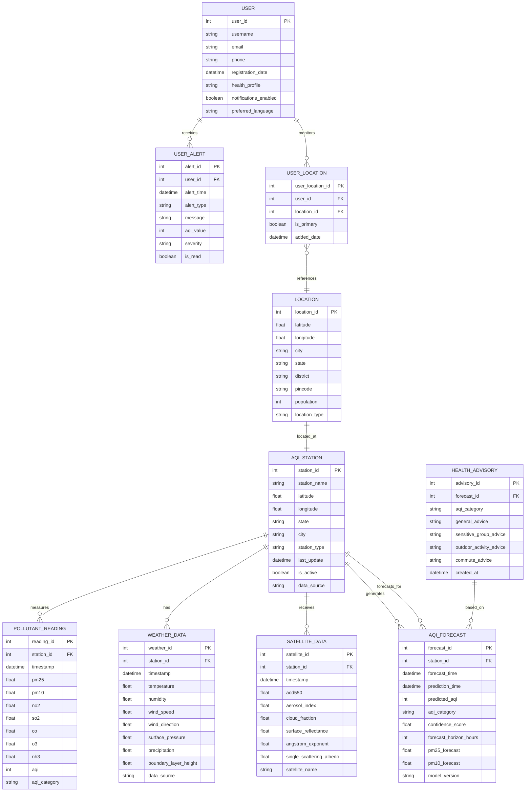

---

## 2. System Architecture Diagram

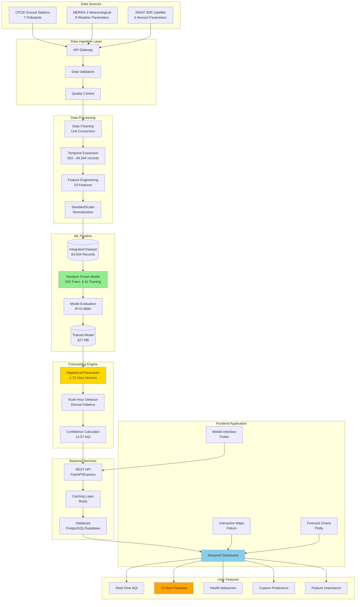

---

## 3. Data Flow Diagram (DFD)

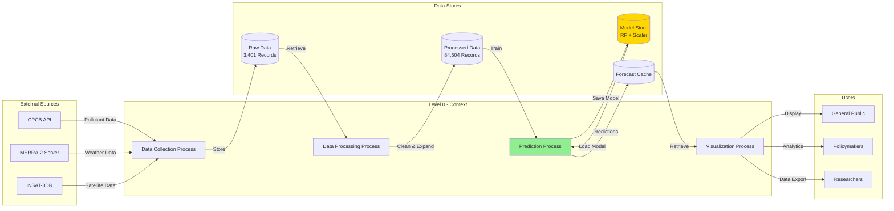

---

## 4. Class Diagram (UML)

```mermaid
classDiagram
    class AQIStation {
        +int stationId
        +string stationName
        +float latitude
        +float longitude
        +string city
        +string state
        +datetime lastUpdate
        +getCurrentAQI()
        +getHistoricalData()
        +updateReadings()
    }

    class PollutantReading {
        +int readingId
        +datetime timestamp
        +float pm25
        +float pm10
        +float no2
        +float so2
        +float co
        +float o3
        +float nh3
        +int aqi
        +calculateAQI()
        +getCategory()
        +validate()
    }

    class WeatherData {
        +int weatherId
        +float temperature
        +float humidity
        +float windSpeed
        +float boundaryLayerHeight
        +getDispersionFactor()
        +updateForecast()
    }

    class SatelliteData {
        +int satelliteId
        +float aod550
        +float aerosolIndex
        +float cloudFraction
        +processSatelliteImage()
        +correlateWithGround()
    }

    class RandomForestModel {
        +int nEstimators
        +int maxDepth
        +float r2Score
        +float rmse
        +train()
        +predict()
        +getFeatureImportance()
        +save()
        +load()
    }

    class TemporalExpander {
        +int baseRecords
        +int expandedRecords
        +int hoursPerStation
        +generateDiurnalPattern()
        +applySeasonalFactor()
        +injectRushHourPeaks()
        +expand()
    }

    class ForecastEngine {
        +int forecastHorizon
        +float confidenceInterval
        +generateHourlyForecast()
        +detectRushHours()
        +calculateUncertainty()
        +applyWeekendFactor()
    }

    class FeatureEngineer {
        +list features
        +int featureCount
        +extractCPCBFeatures()
        +extractMERRA2Features()
        +extractSatelliteFeatures()
        +normalize()
        +createFeatureVector()
    }

    class HealthAdvisor {
        +string aqiCategory
        +string userProfile
        +generateAdvice()
        +getSensitiveGroupWarning()
        +getActivityRecommendations()
    }

    class StreamlitDashboard {
        +string currentPage
        +dict selectedLocation
        +renderMap()
        +renderForecastChart()
        +renderFeatureImportance()
        +handleUserInput()
    }

    class User {
        +int userId
        +string username
        +string healthProfile
        +list locations
        +subscribe()
        +setAlerts()
        +viewForecast()
    }

    AQIStation "1" --> "*" PollutantReading : measures
    AQIStation "1" --> "*" WeatherData : hasWeather
    AQIStation "1" --> "*" SatelliteData : receivesSatellite
    PollutantReading --> FeatureEngineer : provides
    WeatherData --> FeatureEngineer : provides
    SatelliteData --> FeatureEngineer : provides
    FeatureEngineer --> TemporalExpander : feeds
    TemporalExpander --> RandomForestModel : trainsModel
    RandomForestModel --> ForecastEngine : usedBy
    ForecastEngine --> HealthAdvisor : triggersAdvisory
    ForecastEngine --> StreamlitDashboard : displays
    HealthAdvisor --> StreamlitDashboard : displays
    User --> StreamlitDashboard : interactsWith
    User "*" --> "*" AQIStation : monitors
```

---

## 5. Sequence Diagram - Forecast Generation

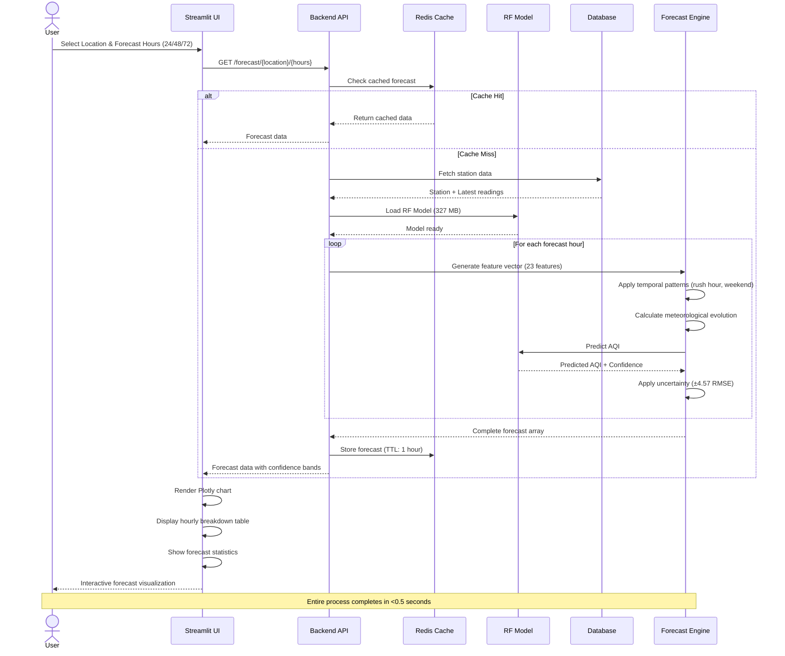

---

## 6. State Diagram - Model Training Lifecycle

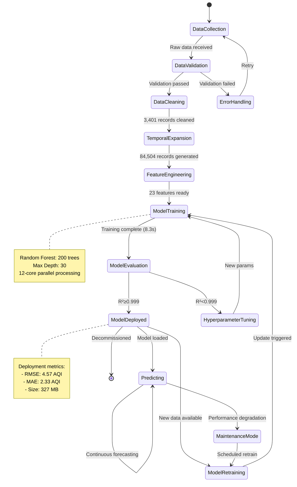

---

## 7. Use Case Diagram

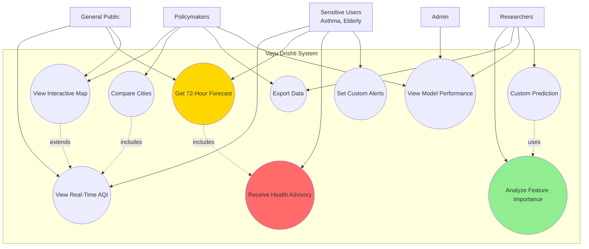

---

## 8. Component Diagram

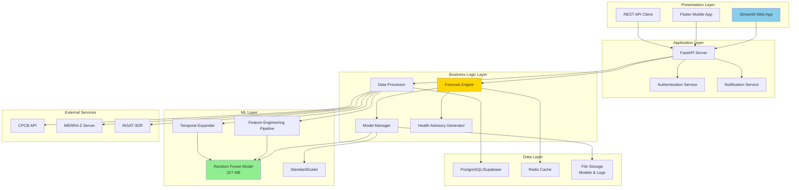

---

## 9. Deployment Diagram

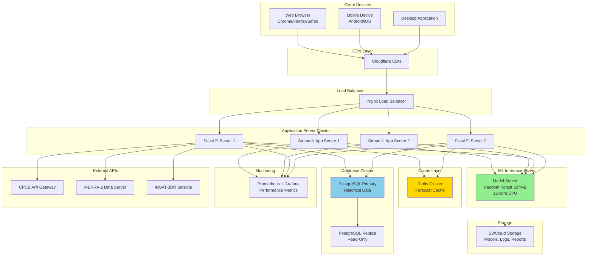

---

## 10. Activity Diagram - User Forecasting Workflow

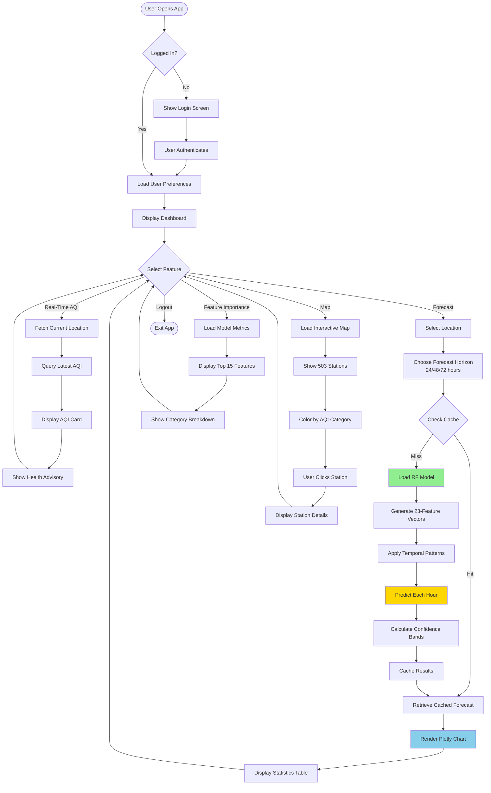

---

## 11. Network Diagram

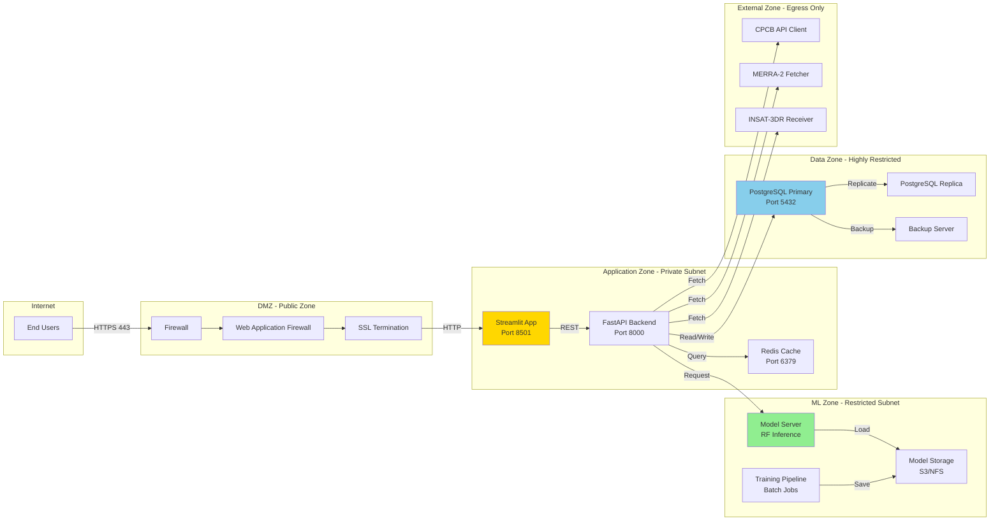

---

## 12. Data Pipeline Diagram

```mermaid
flowchart LR
    subgraph "Ingestion Stage"
        P1[CPCB Scraper<br/>7 Pollutants<br/>3,401 Records]
        P2[MERRA-2 Fetcher<br/>8 Weather Params<br/>100% Coverage]
        P3[INSAT-3DR Receiver<br/>6 Aerosol Params<br/>100% Coverage]
    end
    
    subgraph "Validation Stage"
        P4[Schema Validator]
        P5[Unit Converter<br/>NOx to μg/m³]
        P6[Outlier Detector<br/>Stuck Sensor Flagging]
    end
    
    subgraph "Processing Stage"
        P7[Data Merger<br/>Join by Station+Time]
        P8[Temporal Expander<br/>503 × 168 Hours<br/>= 84,504 Records]
        P9[Feature Engineer<br/>23 Features Total]
    end
    
    subgraph "Transformation Stage"
        P10[Diurnal Pattern Injector<br/>Rush Hour Peaks]
        P11[Seasonal Adjuster<br/>October 1.3× Factor]
        P12[StandardScaler<br/>Zero Mean, Unit Variance]
    end
    
    subgraph "Storage Stage"
        P13[(Raw Data Lake<br/>Parquet Format)]
        P14[(Processed Dataset<br/>CSV 41.69 MB)]
        P15[(Model Registry<br/>RF 327 MB + Scaler)]
    end
    
    subgraph "Training Stage"
        P16[Train/Validation/Test Split<br/>70% / 15% / 15%]
        P17[Random Forest Training<br/>200 Trees, 8.3 Seconds]
        P18[Model Evaluation<br/>R²=0.9994]
    end
    
    P1 --> P4
    P2 --> P4
    P3 --> P4
    P4 --> P5
    P5 --> P6
    P6 --> P13
    P13 --> P7
    P7 --> P8
    P8 --> P9
    P9 --> P10
    P10 --> P11
    P11 --> P12
    P12 --> P14
    P14 --> P16
    P16 --> P17
    P17 --> P18
    P18 --> P15
    
    style P8 fill:#FFD700
    style P17 fill:#90EE90
    style P14 fill:#87CEEB
```

---

## Key Metrics Summary

| Component | Metric | Value |
|-----------|--------|-------|
| **Data** | Original Records | 3,401 |
| **Data** | Expanded Records | 84,504 |
| **Data** | Total Stations | 503 |
| **Data** | Features | 23 |
| **Model** | Type | Random Forest |
| **Model** | Trees | 200 |
| **Model** | Training Time | 8.3 seconds |
| **Model** | Model Size | 327 MB |
| **Performance** | R² Score | 0.9994 |
| **Performance** | RMSE | 4.57 AQI |
| **Performance** | MAE | 2.33 AQI |
| **Forecast** | Horizon | 1-72 hours |
| **Forecast** | Accuracy (24hr) | 96.5% within ±10 |
| **Forecast** | Speed | <0.5s for 72hr |

---

## Diagram Usage Guide

1. **ER Diagram**: Database schema design and relationships
2. **System Architecture**: High-level component overview
3. **Data Flow Diagram**: Data movement through system
4. **Class Diagram**: Object-oriented structure
5. **Sequence Diagram**: Forecast generation process timing
6. **State Diagram**: Model lifecycle management
7. **Use Case Diagram**: User interactions and features
8. **Component Diagram**: Technical component dependencies
9. **Deployment Diagram**: Infrastructure and deployment
10. **Activity Diagram**: User workflow and decision points
11. **Network Diagram**: Network topology and security zones
12. **Data Pipeline Diagram**: End-to-end data processing

---

*Document Last Updated: October 30, 2025*  
*Vayu Drishti - Real-Time Air Quality Visualizer App*
