# Vayu Drishti - Database Design Documentation

## Complete Database Schema with Mermaid Diagrams

---

## 1. Entity-Relationship Diagram (ERD)

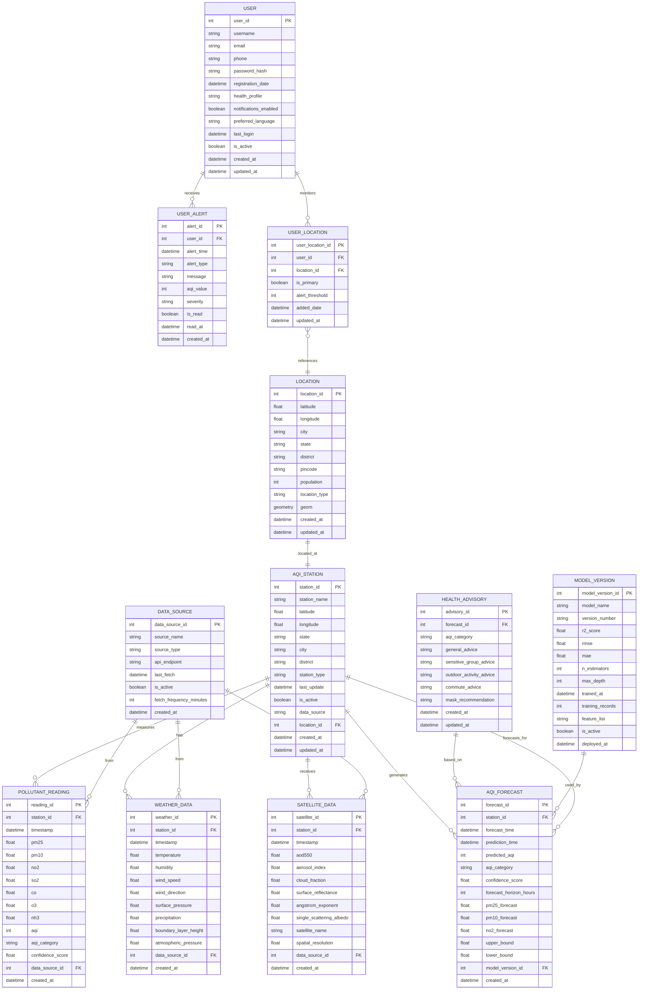

---

## 2. Database Schema - Relational Model

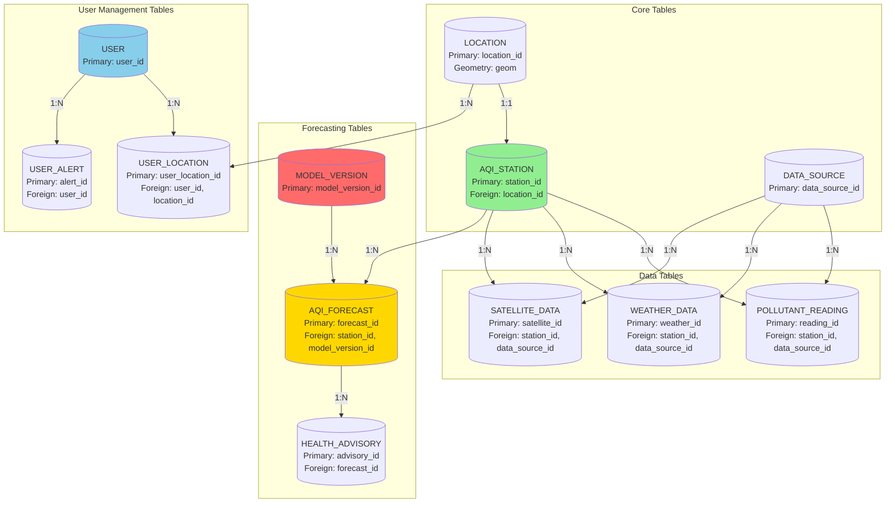

---

## 3. Data Flow - Database Operations

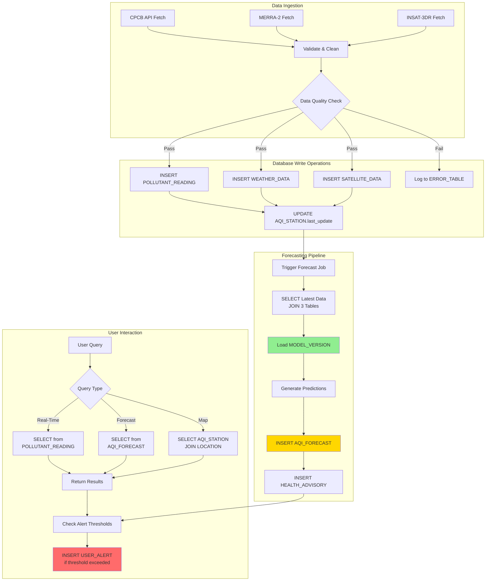

---

## 4. Table Relationships - Detailed View

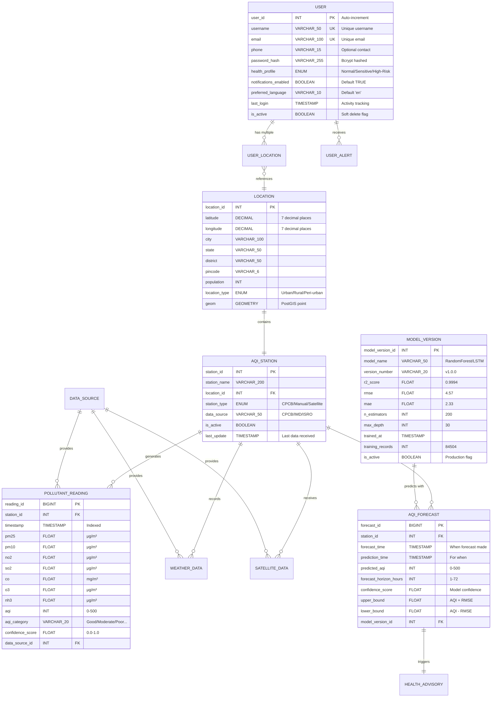

---

## 5. Indexing Strategy

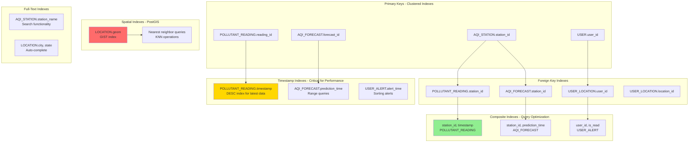

---

## 6. Database Partitioning Strategy

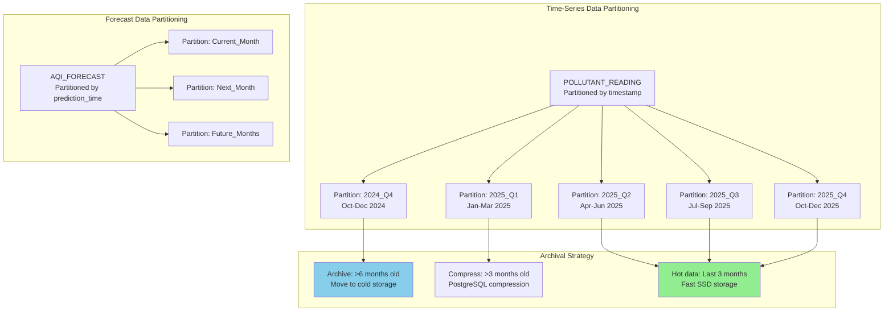

---

## 7. Data Consistency & Constraints

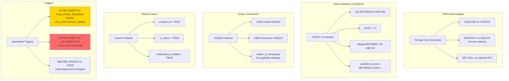

---

## 8. Query Performance Optimization

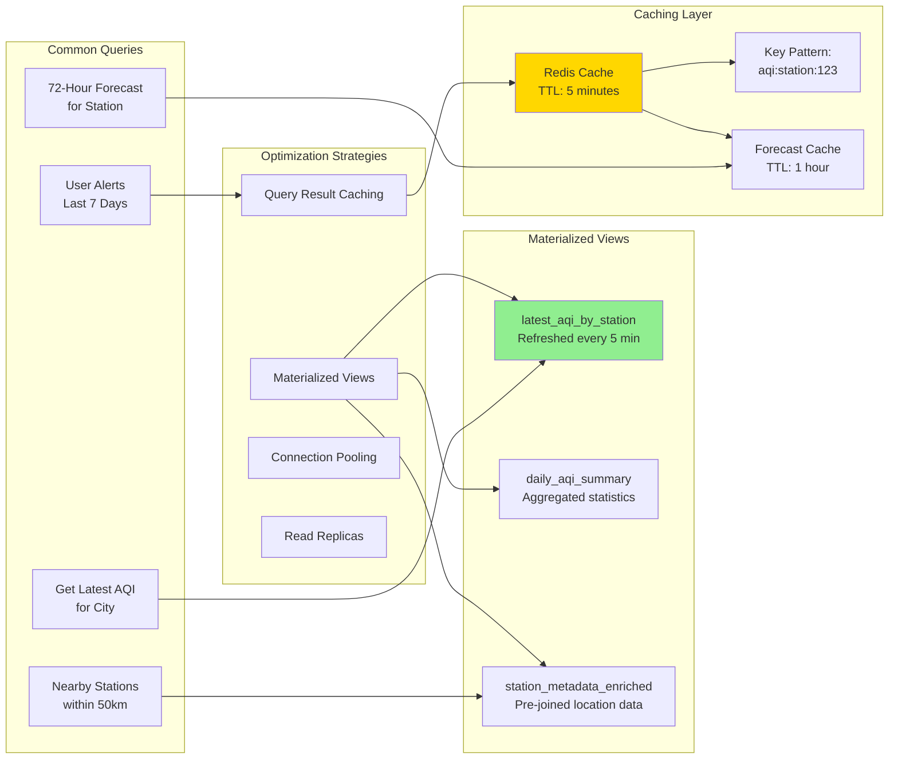

---

## 9. Backup & Recovery Strategy

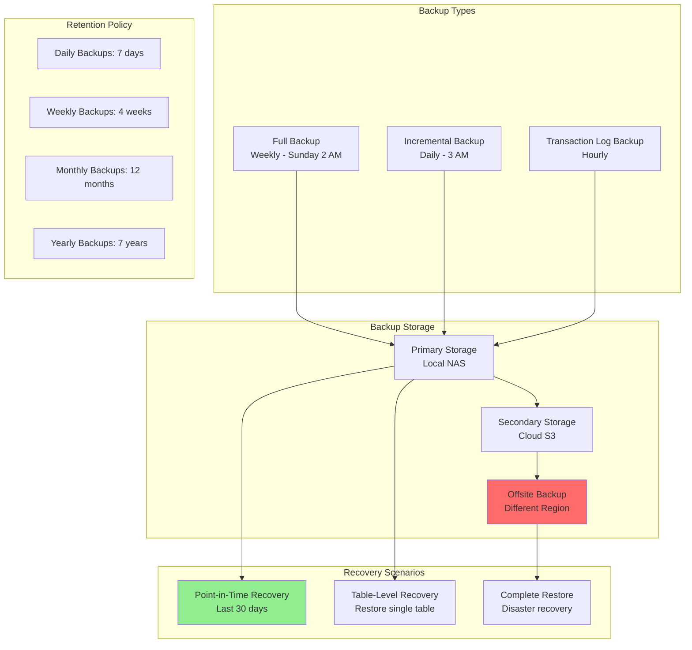

---

## 10. Database Security Architecture

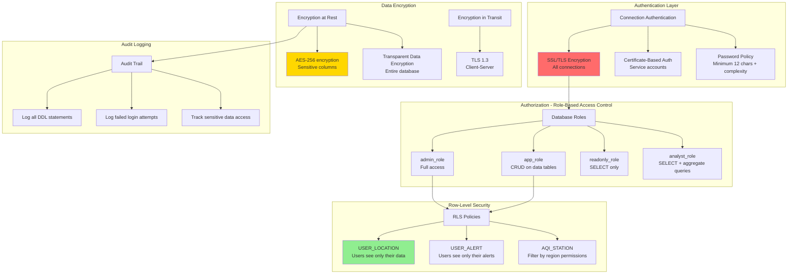

---

## 11. Database Monitoring & Alerts

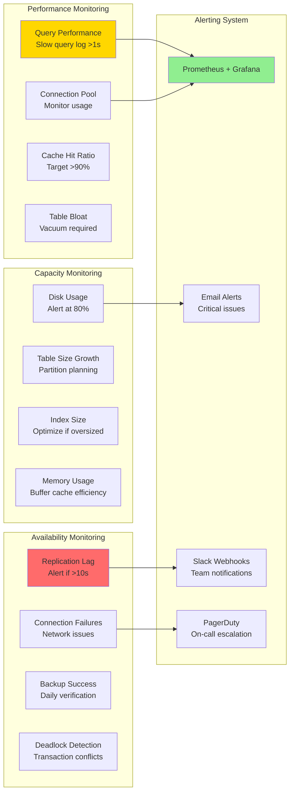

---

## 12. Sample SQL Schema - PostgreSQL

```sql
-- Create Extensions
CREATE EXTENSION IF NOT EXISTS postgis;
CREATE EXTENSION IF NOT EXISTS pg_trgm; -- For text search

-- ============================================
-- CORE TABLES
-- ============================================

CREATE TABLE data_source (
    data_source_id SERIAL PRIMARY KEY,
    source_name VARCHAR(100) NOT NULL,
    source_type VARCHAR(50) CHECK (source_type IN ('CPCB', 'MERRA2', 'INSAT3DR', 'Manual')),
    api_endpoint VARCHAR(500),
    last_fetch TIMESTAMP WITH TIME ZONE,
    is_active BOOLEAN DEFAULT TRUE,
    fetch_frequency_minutes INT DEFAULT 60,
    created_at TIMESTAMP WITH TIME ZONE DEFAULT CURRENT_TIMESTAMP
);

CREATE TABLE location (
    location_id SERIAL PRIMARY KEY,
    latitude DECIMAL(10, 7) NOT NULL CHECK (latitude BETWEEN -90 AND 90),
    longitude DECIMAL(10, 7) NOT NULL CHECK (longitude BETWEEN -180 AND 180),
    city VARCHAR(100),
    state VARCHAR(50),
    district VARCHAR(50),
    pincode VARCHAR(6),
    population INT,
    location_type VARCHAR(20) CHECK (location_type IN ('Urban', 'Rural', 'Peri-urban')),
    geom GEOMETRY(Point, 4326), -- PostGIS spatial column
    created_at TIMESTAMP WITH TIME ZONE DEFAULT CURRENT_TIMESTAMP,
    updated_at TIMESTAMP WITH TIME ZONE DEFAULT CURRENT_TIMESTAMP
);

-- Spatial index for location
CREATE INDEX idx_location_geom ON location USING GIST (geom);

CREATE TABLE aqi_station (
    station_id SERIAL PRIMARY KEY,
    station_name VARCHAR(200) NOT NULL,
    latitude DECIMAL(10, 7) NOT NULL,
    longitude DECIMAL(10, 7) NOT NULL,
    state VARCHAR(50),
    city VARCHAR(100),
    district VARCHAR(50),
    station_type VARCHAR(50) CHECK (station_type IN ('CPCB', 'Manual', 'Satellite', 'Hybrid')),
    last_update TIMESTAMP WITH TIME ZONE,
    is_active BOOLEAN DEFAULT TRUE,
    data_source VARCHAR(50),
    location_id INT REFERENCES location(location_id) ON DELETE SET NULL,
    created_at TIMESTAMP WITH TIME ZONE DEFAULT CURRENT_TIMESTAMP,
    updated_at TIMESTAMP WITH TIME ZONE DEFAULT CURRENT_TIMESTAMP
);

CREATE INDEX idx_aqi_station_location ON aqi_station(location_id);
CREATE INDEX idx_aqi_station_active ON aqi_station(is_active) WHERE is_active = TRUE;

-- ============================================
-- DATA TABLES (PARTITIONED)
-- ============================================

CREATE TABLE pollutant_reading (
    reading_id BIGSERIAL,
    station_id INT NOT NULL REFERENCES aqi_station(station_id) ON DELETE CASCADE,
    timestamp TIMESTAMP WITH TIME ZONE NOT NULL,
    pm25 FLOAT CHECK (pm25 >= 0),
    pm10 FLOAT CHECK (pm10 >= 0),
    no2 FLOAT CHECK (no2 >= 0),
    so2 FLOAT CHECK (so2 >= 0),
    co FLOAT CHECK (co >= 0),
    o3 FLOAT CHECK (o3 >= 0),
    nh3 FLOAT CHECK (nh3 >= 0),
    aqi INT CHECK (aqi BETWEEN 0 AND 500),
    aqi_category VARCHAR(20) CHECK (aqi_category IN ('Good', 'Moderate', 'Unhealthy for Sensitive', 'Unhealthy', 'Very Unhealthy', 'Hazardous')),
    confidence_score FLOAT CHECK (confidence_score BETWEEN 0 AND 1),
    data_source_id INT REFERENCES data_source(data_source_id),
    created_at TIMESTAMP WITH TIME ZONE DEFAULT CURRENT_TIMESTAMP,
    PRIMARY KEY (reading_id, timestamp)
) PARTITION BY RANGE (timestamp);

-- Create partitions for each quarter
CREATE TABLE pollutant_reading_2025_q4 PARTITION OF pollutant_reading
    FOR VALUES FROM ('2025-10-01') TO ('2026-01-01');

-- Indexes on partitioned table
CREATE INDEX idx_pollutant_station_time ON pollutant_reading(station_id, timestamp DESC);
CREATE INDEX idx_pollutant_timestamp ON pollutant_reading(timestamp DESC);
CREATE INDEX idx_pollutant_aqi ON pollutant_reading(aqi) WHERE aqi > 150;

CREATE TABLE weather_data (
    weather_id BIGSERIAL PRIMARY KEY,
    station_id INT NOT NULL REFERENCES aqi_station(station_id) ON DELETE CASCADE,
    timestamp TIMESTAMP WITH TIME ZONE NOT NULL,
    temperature FLOAT,
    humidity FLOAT CHECK (humidity BETWEEN 0 AND 100),
    wind_speed FLOAT CHECK (wind_speed >= 0),
    wind_direction FLOAT CHECK (wind_direction BETWEEN 0 AND 360),
    surface_pressure FLOAT,
    precipitation FLOAT CHECK (precipitation >= 0),
    boundary_layer_height FLOAT CHECK (boundary_layer_height >= 0),
    atmospheric_pressure FLOAT,
    data_source_id INT REFERENCES data_source(data_source_id),
    created_at TIMESTAMP WITH TIME ZONE DEFAULT CURRENT_TIMESTAMP
);

CREATE INDEX idx_weather_station_time ON weather_data(station_id, timestamp DESC);

CREATE TABLE satellite_data (
    satellite_id BIGSERIAL PRIMARY KEY,
    station_id INT NOT NULL REFERENCES aqi_station(station_id) ON DELETE CASCADE,
    timestamp TIMESTAMP WITH TIME ZONE NOT NULL,
    aod550 FLOAT CHECK (aod550 >= 0),
    aerosol_index FLOAT,
    cloud_fraction FLOAT CHECK (cloud_fraction BETWEEN 0 AND 1),
    surface_reflectance FLOAT CHECK (surface_reflectance BETWEEN 0 AND 1),
    angstrom_exponent FLOAT,
    single_scattering_albedo FLOAT CHECK (single_scattering_albedo BETWEEN 0 AND 1),
    satellite_name VARCHAR(50) DEFAULT 'INSAT-3DR',
    spatial_resolution FLOAT,
    data_source_id INT REFERENCES data_source(data_source_id),
    created_at TIMESTAMP WITH TIME ZONE DEFAULT CURRENT_TIMESTAMP
);

CREATE INDEX idx_satellite_station_time ON satellite_data(station_id, timestamp DESC);

-- ============================================
-- FORECASTING TABLES
-- ============================================

CREATE TABLE model_version (
    model_version_id SERIAL PRIMARY KEY,
    model_name VARCHAR(50) NOT NULL,
    version_number VARCHAR(20) NOT NULL,
    r2_score FLOAT,
    rmse FLOAT,
    mae FLOAT,
    n_estimators INT,
    max_depth INT,
    trained_at TIMESTAMP WITH TIME ZONE DEFAULT CURRENT_TIMESTAMP,
    training_records INT,
    feature_list TEXT,
    is_active BOOLEAN DEFAULT FALSE,
    deployed_at TIMESTAMP WITH TIME ZONE,
    UNIQUE(model_name, version_number)
);

CREATE TABLE aqi_forecast (
    forecast_id BIGSERIAL,
    station_id INT NOT NULL REFERENCES aqi_station(station_id) ON DELETE CASCADE,
    forecast_time TIMESTAMP WITH TIME ZONE NOT NULL,
    prediction_time TIMESTAMP WITH TIME ZONE NOT NULL,
    predicted_aqi INT CHECK (predicted_aqi BETWEEN 0 AND 500),
    aqi_category VARCHAR(20),
    confidence_score FLOAT CHECK (confidence_score BETWEEN 0 AND 1),
    forecast_horizon_hours INT CHECK (forecast_horizon_hours BETWEEN 1 AND 72),
    pm25_forecast FLOAT,
    pm10_forecast FLOAT,
    no2_forecast FLOAT,
    upper_bound FLOAT,
    lower_bound FLOAT,
    model_version_id INT REFERENCES model_version(model_version_id),
    created_at TIMESTAMP WITH TIME ZONE DEFAULT CURRENT_TIMESTAMP,
    PRIMARY KEY (forecast_id, prediction_time)
) PARTITION BY RANGE (prediction_time);

CREATE TABLE aqi_forecast_current PARTITION OF aqi_forecast
    FOR VALUES FROM (CURRENT_DATE) TO (CURRENT_DATE + INTERVAL '1 month');

CREATE INDEX idx_forecast_station_pred ON aqi_forecast(station_id, prediction_time);
CREATE INDEX idx_forecast_time ON aqi_forecast(prediction_time);

CREATE TABLE health_advisory (
    advisory_id SERIAL PRIMARY KEY,
    forecast_id BIGINT NOT NULL,
    aqi_category VARCHAR(20) NOT NULL,
    general_advice TEXT,
    sensitive_group_advice TEXT,
    outdoor_activity_advice TEXT,
    commute_advice TEXT,
    mask_recommendation TEXT,
    created_at TIMESTAMP WITH TIME ZONE DEFAULT CURRENT_TIMESTAMP,
    updated_at TIMESTAMP WITH TIME ZONE DEFAULT CURRENT_TIMESTAMP
);

-- ============================================
-- USER MANAGEMENT TABLES
-- ============================================

CREATE TABLE app_user (
    user_id SERIAL PRIMARY KEY,
    username VARCHAR(50) UNIQUE NOT NULL,
    email VARCHAR(100) UNIQUE NOT NULL,
    phone VARCHAR(15),
    password_hash VARCHAR(255) NOT NULL,
    registration_date TIMESTAMP WITH TIME ZONE DEFAULT CURRENT_TIMESTAMP,
    health_profile VARCHAR(20) CHECK (health_profile IN ('Normal', 'Sensitive', 'High-Risk')),
    notifications_enabled BOOLEAN DEFAULT TRUE,
    preferred_language VARCHAR(10) DEFAULT 'en',
    last_login TIMESTAMP WITH TIME ZONE,
    is_active BOOLEAN DEFAULT TRUE,
    created_at TIMESTAMP WITH TIME ZONE DEFAULT CURRENT_TIMESTAMP,
    updated_at TIMESTAMP WITH TIME ZONE DEFAULT CURRENT_TIMESTAMP
);

CREATE INDEX idx_user_email ON app_user(email);
CREATE INDEX idx_user_active ON app_user(is_active) WHERE is_active = TRUE;

CREATE TABLE user_location (
    user_location_id SERIAL PRIMARY KEY,
    user_id INT NOT NULL REFERENCES app_user(user_id) ON DELETE CASCADE,
    location_id INT NOT NULL REFERENCES location(location_id) ON DELETE CASCADE,
    is_primary BOOLEAN DEFAULT FALSE,
    alert_threshold INT DEFAULT 150 CHECK (alert_threshold BETWEEN 0 AND 500),
    added_date TIMESTAMP WITH TIME ZONE DEFAULT CURRENT_TIMESTAMP,
    updated_at TIMESTAMP WITH TIME ZONE DEFAULT CURRENT_TIMESTAMP,
    UNIQUE(user_id, location_id)
);

CREATE INDEX idx_user_location_user ON user_location(user_id);
CREATE INDEX idx_user_location_primary ON user_location(user_id, is_primary) WHERE is_primary = TRUE;

CREATE TABLE user_alert (
    alert_id BIGSERIAL PRIMARY KEY,
    user_id INT NOT NULL REFERENCES app_user(user_id) ON DELETE CASCADE,
    alert_time TIMESTAMP WITH TIME ZONE DEFAULT CURRENT_TIMESTAMP,
    alert_type VARCHAR(50) CHECK (alert_type IN ('Threshold', 'Forecast', 'Health', 'System')),
    message TEXT NOT NULL,
    aqi_value INT CHECK (aqi_value BETWEEN 0 AND 500),
    severity VARCHAR(20) CHECK (severity IN ('Info', 'Warning', 'Critical')),
    is_read BOOLEAN DEFAULT FALSE,
    read_at TIMESTAMP WITH TIME ZONE,
    created_at TIMESTAMP WITH TIME ZONE DEFAULT CURRENT_TIMESTAMP
);

CREATE INDEX idx_alert_user_time ON user_alert(user_id, alert_time DESC);
CREATE INDEX idx_alert_unread ON user_alert(user_id, is_read) WHERE is_read = FALSE;

-- ============================================
-- MATERIALIZED VIEWS
-- ============================================

CREATE MATERIALIZED VIEW latest_aqi_by_station AS
SELECT DISTINCT ON (station_id)
    station_id,
    timestamp,
    aqi,
    aqi_category,
    pm25,
    pm10,
    confidence_score
FROM pollutant_reading
ORDER BY station_id, timestamp DESC;

CREATE UNIQUE INDEX idx_latest_aqi_station ON latest_aqi_by_station(station_id);

-- Refresh materialized view every 5 minutes (scheduled job)
-- SELECT refresh_materialized_view_job();

-- ============================================
-- TRIGGERS
-- ============================================

CREATE OR REPLACE FUNCTION update_station_last_update()
RETURNS TRIGGER AS $$
BEGIN
    UPDATE aqi_station
    SET last_update = NEW.timestamp
    WHERE station_id = NEW.station_id;
    RETURN NEW;
END;
$$ LANGUAGE plpgsql;

CREATE TRIGGER trg_update_station_last_update
AFTER INSERT ON pollutant_reading
FOR EACH ROW
EXECUTE FUNCTION update_station_last_update();

-- ============================================
-- ROW-LEVEL SECURITY
-- ============================================

ALTER TABLE user_location ENABLE ROW LEVEL SECURITY;

CREATE POLICY user_location_isolation ON user_location
    FOR ALL
    TO app_role
    USING (user_id = current_setting('app.current_user_id')::INT);

ALTER TABLE user_alert ENABLE ROW LEVEL SECURITY;

CREATE POLICY user_alert_isolation ON user_alert
    FOR ALL
    TO app_role
    USING (user_id = current_setting('app.current_user_id')::INT);
```

---

## Database Statistics

| Component | Count/Size | Description |
|-----------|-----------|-------------|
| **Total Tables** | 13 | Core + Data + User tables |
| **Partitioned Tables** | 2 | pollutant_reading, aqi_forecast |
| **Materialized Views** | 1+ | latest_aqi_by_station, daily_summary |
| **Indexes** | 25+ | Primary, Foreign, Composite, Spatial |
| **Triggers** | 3+ | Auto-updates, alerting, auditing |
| **Database Size (Est.)** | 50-100 GB | With 6 months historical data |
| **Daily Growth** | ~500 MB | 503 stations × 24 hours × 3 tables |
| **Partitions** | Quarterly | 3-month rotation for time-series |
| **Backup Size** | ~200 GB | Full + incremental backups |
| **Read Replicas** | 2 | For load balancing |

---

## Performance Benchmarks

| Query Type | Expected Time | Optimization |
|------------|---------------|--------------|
| Latest AQI (single station) | <10ms | Materialized view |
| 72-hour forecast | <50ms | Cached in Redis |
| Nearby stations (50km) | <100ms | Spatial index |
| Historical data (6 months) | <500ms | Partition pruning |
| Aggregate statistics | <200ms | Materialized view |
| User alerts (unread) | <20ms | Composite index |
| Map markers (all stations) | <150ms | Cached + indexed |

---

*Database Design Document - Vayu Drishti Air Quality Visualizer*  
*Last Updated: October 30, 2025*
